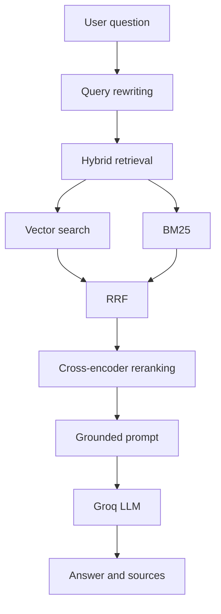

# DevOps Troubleshooting Assistant

An AI-powered DevOps troubleshooting assistant for Docker questions. The application retrieves relevant official Docker documentation, generates grounded technical answers, and displays the supporting source excerpts.

## What It Does

DevOps engineers often need to troubleshoot issues involving:

- Containers and images
- Networking and port exposure
- Volumes and persistent storage
- Environment variables
- Docker Compose

Finding the right explanation inside a large documentation set can be time-consuming. This project combines hybrid retrieval, reranking, and grounded LLM generation to make that investigation faster while keeping the evidence visible.

## Architecture



## Knowledge Base

The current knowledge base contains:

- **Source:** Official Docker documentation
- **Documents:** 838
- **Chunks:** 13,816
- **Embeddings:** `BAAI/bge-small-en-v1.5`
- **Vector database:** Qdrant
- **Collection:** `devops_docs`

## Technology Stack

| Area | Technologies |
| --- | --- |
| Frontend | React, TypeScript, Tailwind CSS, Recharts, Lucide React |
| Backend | FastAPI, Python |
| Retrieval | Qdrant, BM25, Reciprocal Rank Fusion (RRF) |
| Reranking | FastEmbed Cross-Encoder |
| Embeddings | `BAAI/bge-small-en-v1.5` |
| LLM | Groq, `openai/gpt-oss-20b` |

## Project Structure

```text
.
├── frontend/
│   ├── src/
│   │   ├── components/       # Shared layout and UI components
│   │   ├── pages/            # Assistant, monitoring, evaluation, About
│   │   ├── services/         # API clients
│   │   └── types/            # Frontend data contracts
│   └── package.json
├── src/
│   ├── api/                  # FastAPI application and routes
│   ├── evaluation/           # Retrieval and LLM evaluation scripts
│   ├── llm/                  # Prompt and model generation
│   ├── monitoring/           # Query, latency, score, and feedback logging
│   ├── retrieval/            # Search, rewriting, and reranking
│   └── rag_pipeline.py       # Main RAG orchestration
├── ingestion/                # Documentation extraction, chunking, and embeddings
├── data/
│   ├── docker/               # Source Docker documentation
│   ├── evaluation/           # Evaluation questions and result files
│   └── processed/            # Processed document and chunk data
├── .env                    # Local secrets; do not commit
└── README.md
```

## Requirements

- Windows, macOS, or Linux
- Python 3.11 or newer recommended
- Node.js 18 or newer
- npm
- A Qdrant Cloud project and collection populated with the project data
- A Groq API key

## Environment Variables

Create a local `.env` file at the repository root. Never commit real credentials.

```env
GROQ_API_KEY=your_groq_api_key
QDRANT_URL=https://your-qdrant-endpoint
QDRANT_API_KEY=your_qdrant_api_key
```

The frontend uses `frontend/.env`:

```env
VITE_API_URL=http://localhost:8000/api
```

A safe frontend template is available at `frontend/.env.example`. The root `.env` file should be created locally and must not be committed.

## Backend Setup

From the repository root, create and activate a virtual environment.

### PowerShell

```powershell
python -m venv .venv
.venv\Scripts\Activate.ps1
```

Install the backend dependencies used by the current source tree:

```powershell
python -m pip install --upgrade pip
python -m pip install fastapi uvicorn python-dotenv groq qdrant-client fastembed numpy rank-bm25
```

If PowerShell blocks activation, run this once for the current user or activate the environment through another shell:

```powershell
Set-ExecutionPolicy -Scope CurrentUser RemoteSigned
```

Start the API:

```powershell
uvicorn src.api.main:app --reload --port 8000
```

The API will be available at `http://localhost:8000`.

Interactive API documentation is available at:

- `http://localhost:8000/docs`
- `http://localhost:8000/redoc`

## Frontend Setup

Open a second terminal:

```powershell
cd frontend
npm install
npm run dev
```

The Vite development server is normally available at `http://localhost:5173`.

To create a production build:

```powershell
npm run build
```

To preview the production build:

```powershell
npm run preview
```

## Main API Routes

| Method | Route | Purpose |
| --- | --- | --- |
| `GET` | `/api/health` | Check API availability |
| `POST` | `/api/chat` | Run the troubleshooting pipeline |
| `POST` | `/api/feedback` | Record positive or negative feedback |
| `GET` | `/api/metrics` | Return monitoring overview and chart data |
| `GET` | `/api/evaluation/retrieval` | Return retrieval evaluation metrics |
| `GET` | `/api/evaluation/llm` | Return LLM evaluation metrics |

Example chat request:

```powershell
Invoke-RestMethod `
  -Uri http://localhost:8000/api/chat `
  -Method Post `
  -ContentType 'application/json' `
  -Body '{"query":"My Docker container loses data after restart"}'
```

## Evaluation

The evaluation page compares retrieval approaches:

- BM25
- Vector Search
- Hybrid Search
- Hybrid + Reranking

It also compares generation strategies:

- Basic Prompt
- Grounded Prompt

Run retrieval evaluation from the repository root:

```powershell
python -m src.evaluation.evaluate_retrieval
```

Run LLM evaluation:

```powershell
python -m src.evaluation.evaluate_llm
```

Results are written to:

- `data/evaluation/retrieval_results.json`
- `data/evaluation/llm_results.json`

The current recorded results indicate that **Hybrid + Reranking** performs best for retrieval and **Grounded Prompt** performs best for LLM evaluation. Evaluation scores are heuristic indicators and should be interpreted alongside manual review.

## Monitoring

The API records:

- Query count
- Response latency
- Retrieval scores
- Reranking scores
- Positive and negative feedback
- Problem categories

The Monitoring page reads these values from `GET /api/metrics` and displays the overview cards and Recharts visualizations. When no queries have been recorded, the dashboard displays an empty state instead of inventing values.

Monitoring files are stored as `data/monitoring.jsonl` and `data/feedback.jsonl` when the application has generated them locally.

## Documentation Ingestion

The ingestion scripts are kept separate from the runtime API. They support extracting, processing, chunking, embedding, and uploading documentation.

Relevant scripts include:

```powershell
python ingestion/extract_markdown.py
python ingestion/process_documents.py
python ingestion/chunk_documents.py
python ingestion/create_embeddings.py
```

Review each script's input and output paths before running an ingestion step. Existing processed data and evaluation artifacts should not be overwritten without a backup.

## Docker

Docker-related source documentation is stored in `data/docker/`. The current project can be run locally with the Python and Vite commands above. If you add a Docker deployment, keep API environment variables outside the image and provide them through runtime environment configuration or a secrets manager.

## Troubleshooting

### Frontend cannot reach the API

Confirm that:

1. FastAPI is running on port `8000`.
2. `frontend/.env` contains `VITE_API_URL=http://localhost:8000/api`.
3. The frontend dev server was restarted after changing `frontend/.env`.
4. The browser origin is allowed by the FastAPI CORS configuration.

### Qdrant connection fails

Confirm that `QDRANT_URL` and `QDRANT_API_KEY` are present in the root `.env` file and that the Qdrant collection `devops_docs` exists.

### Groq requests fail

Confirm that `GROQ_API_KEY` is present and that the configured Groq account can access `openai/gpt-oss-20b`.

## Security Notes

- Keep `.env` files private.
- Do not place API keys in frontend source code.
- Do not commit generated credentials, local vector database files, or private evaluation data.
- Review generated answers and source excerpts before using them in production operations.
